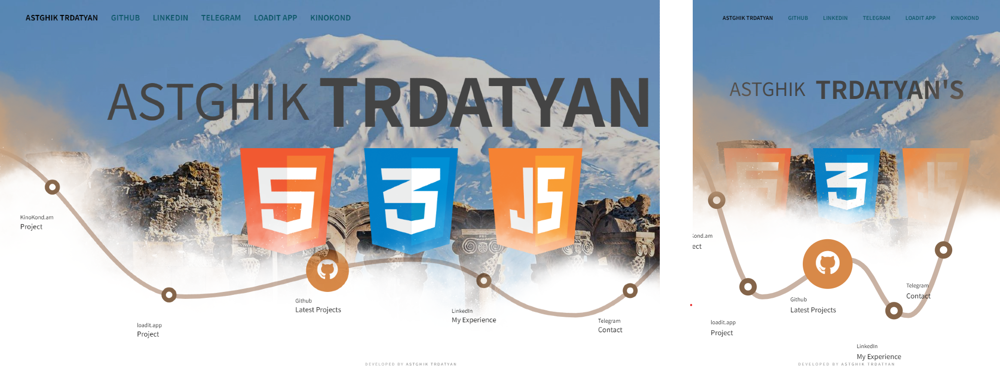

# Vanilla JS Personal Page with Animations

___
## Contents
* [Introduction](#introduction)
* [Features](#features)
* [Synchronization](#synchronization)
___

## Introduction
This is a vanilla HTML-CSS-JS template to customize and develop - not a fully functional view. All code was written from scratch for practicing.

## Features
* Basic navigation bar
* Animated text / titles
* Basic image carousel
* Dynamic SVG Path rendering
* Circle shaped buttons with icons and linked text
* Control each transition speed and duration
* Fully responsive

## Synchronization
So far the view is not in real synchronization since it was implemented as a preview and not yet fully functional as mentioned.
